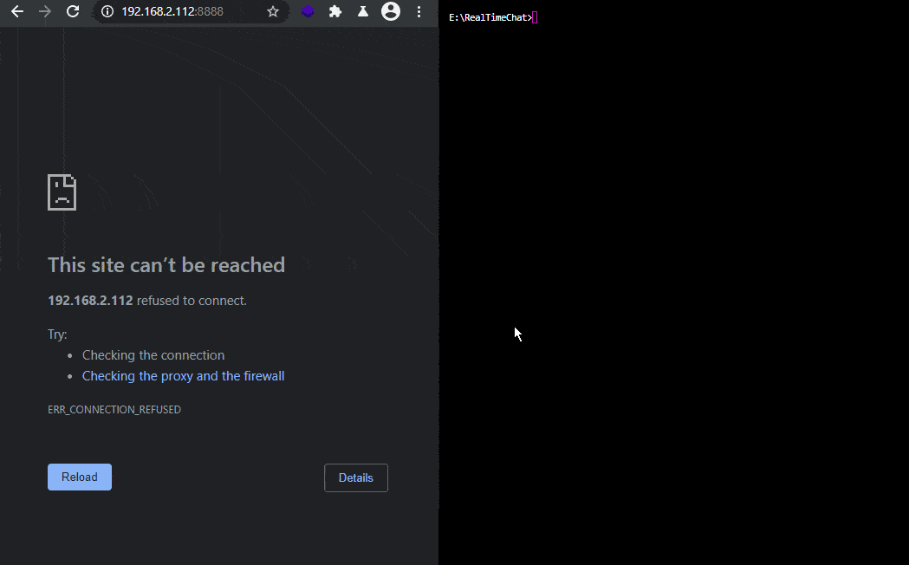

# Realtime Chat Application

## Intorduction to Websockets

Clone the repository, make sure you have Node.js and npm installed and start the app by running:

```bash
npm start
```

You can now access the web frontend with your web browser by going to `http://localhost:8888`:





This web app is using Express.js to serve the content of the __/public__ folder:

_index.js_

```js
const express = require("express");
const socket = require("socket.io");

var app = express();

var port = 8888;

var server = app.listen(port, function () {
  console.log("Listening to Port " + port);
});

app.use(express.static("public"));

var upgradedServer = socket(server);

upgradedServer.on("connection", function (socket) {
  socket.on("sendingMessage", function (data) {
    upgradedServer.emit("broadcastMessage", data);
  });

  console.log("Websocket Connected", socket.id);
});
```


The HTML file that is served adds some CSS, static images, the socket.io javascript file and the websocket chat application `chat.js`:


_index.html_

```html
<!DOCTYPE html>
<html>
    <head>
        <meta charset="utf-8">
        <title>INSTAR Chat</title>
        <link href="/styles/styles.css" rel="stylesheet" />
        <link rel="icon" href="static/favicon.ico">
    </head>
    <body>

        <div id="chat-app">
            <div class="input-container">
                
                <h2 class="text">INSTAR Company Chat</h2>
            </div>
            <div id="chat-window">
                <div id="output"></div>
            </div>
            <div class="input-container">
                <input id="username" type="text" placeholder="Username" />
                <input id="message" type="text" placeholder="Message" />
            </div>
            <button id="send">Send</button>
        </div>

    </body>
    <script src="/js/socket.io.min.js"></script>
    <script src="/js/chat.js"></script>
</html>
```


_chat.js_


```js
let socket = io.connect("http://localhost:8888");

var message = document.getElementById("message");
var button = document.getElementById("send");
var username = document.getElementById("username");
var output = document.getElementById("output");

button.addEventListener("click", function () {
  socket.emit("sendingMessage", {
    message: message.value,
    username: username.value,
  });
});

socket.on("broadcastMessage", function (data) {
  output.innerHTML +=
    "<p><strong>" + data.username + ": </strong>" + data.message + "</p>";
});
```


---

++++++++++++++++++++++++++++++++++++++++++++++++
++++++++++++++++ ORIGINAL README +++++++++++++++++++
++++++++++++++++++++++++++++++++++++++++++++++++

## RealTimeChat
Real Time Chat Application Using Websockets

This is a Real-Time chat application made as part of my Udemy Course, [Practical WebRTC: A Complete WebRTC Bootcamp for Beginners](https://www.udemy.com/course/practical-webrtc-a-complete-webrtc-bootcamp-for-beginners/)

The front end is pure HTML,CSS,Javascript. 
The Backend is in Node.js. 


Steps to run

1. Clone the repository
2. Dependencies are all pushed along with the code so you don't need `npm install`
3. Run `node index.js`
